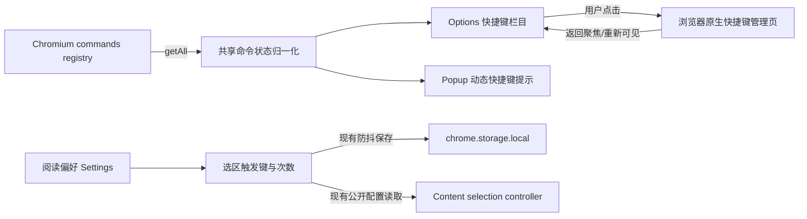

# feat: 新增快捷键与触发方式设置

## Overview

在 Options 中新增统一的“快捷键与触发方式”栏目，分别展示浏览器管理的页面翻译命令和扩展管理的选区内联触发。页面翻译快捷键以浏览器返回的实际绑定为准，Options 提供原生管理页入口，Popup 同步显示真实绑定；选区触发设置迁移到新栏目，新安装默认改为双击 `Ctrl`，旧用户与旧导入配置保持原行为。

该功能不新增 Manifest command，也不把浏览器快捷键写入 `Settings`。浏览器命令是运行时只读状态，用户阅读偏好仍通过现有防抖保存链路持久化。

---

## Problem Frame

当前页面翻译 `Alt+A` 由 Chrome `commands` API 管理，而选区内联翻译由内容脚本监听修饰键。两者分散在 Manifest、Popup 文案和“划词翻译”设置中，导致用户无法统一查看或理解管理边界。Popup 固定显示 `Alt+A`，用户重绑或清除快捷键后会得到错误提示；新安装默认单击 `Ctrl` 还会在常用组合键的后续按键到达前提前触发。

本计划以需求文档为产品边界，不扩充快捷命令集合，不建立自定义按键录制器（see origin: `docs/brainstorms/2026-09-13-shortcuts-settings-requirements.md`）。

---

## Requirements Trace

- R1-R3. 新建统一栏目，将选区触发设置从“划词翻译”迁移，并解释两套管理机制。
- R4-R9. 只处理现有 `translate_page` 命令；读取、展示和刷新实际绑定；提供浏览器管理页入口；区分已分配、未分配和暂不可用；Popup 不再硬编码 `Alt+A`。
- R10-R15. 保留现有修饰键与触发次数能力；新安装默认双击 `Ctrl`；旧配置保持；单击风险提示；Off 状态禁用次数；说明与悬浮按钮相互独立。
- R16-R17. 更新当前用户文档与本地化文案，历史计划和历史发布说明保持原貌。

**Origin actors:** A1（普通阅读用户）、A2（键盘优先用户）、A3（Chromium 浏览器）

**Origin flows:** F1（查看并修改页面翻译快捷键）、F2（配置选区内联翻译触发）

**Origin acceptance examples:** AE1-AE3（真实绑定、未分配、管理页入口）、AE4-AE8（新旧默认、风险提示、Off、双入口独立）

---

## Scope Boundaries

- 不新增翻译、恢复、重试、模式切换、引擎切换或专家切换命令。
- 不在 Options 内录制或直接修改 Manifest command 绑定。
- 不改变 `translate_page` 的 Manifest 建议值和后台命令语义。
- 不在本次重构 Popup 与后台命令的内容脚本按需注入差异，也不扩展受限页面错误体系。
- 不新增 Popup 配置加载失败的原地重试；命令状态读取失败必须与现有配置加载状态解耦，但不扩大 Popup 故障恢复范围。
- 不新增内容脚本设置变化监听。现有选区控制器会在注册和下一次可信选区 `mouseup` 后刷新公开配置，本次保持该生效边界。
- 不实现输入框选中文字翻译并替换。
- 不修改历史设计计划或历史版本发布说明。
- `Escape` 与原生控件键盘操作不纳入可配置快捷键。

### Deferred to Follow-Up Work

- 统一 Popup 与后台命令在普通但无内容脚本页面上的补注入与单次重试策略。
- 区分普通无接收端、浏览器受限页面、文件权限不足和真实注入失败的错误体验。
- 让已打开网页通过设置变化通知立即刷新选区触发配置。
- 为 Popup 配置加载失败增加原地重试。

---

## Context & Research

### Relevant Code and Patterns

- `src/manifest.ts` 只声明 `translate_page`，`suggested_key` 为安装建议值，不是运行时显示来源。
- `src/background/index.ts` 按命令名处理页面翻译，与实际绑定字符串无耦合，本次无需改变。
- `src/options/api.ts` 与 `src/popup/api.ts` 已将 Chrome API 细节封装在 React 组件之外，新增命令读取应沿用该适配层模式。
- `src/options/OptionsApp.tsx` 的设置表单具有加载门禁、500ms 防抖保存和独立导航锚点；快捷键栏目应复用这些结构，不调用完整 `reload()` 刷新浏览器命令。
- `src/shared/config.ts` 已有“新安装默认与旧配置缺字段兼容值分离”的渲染器模式先例。快捷触发同样只修改 `DEFAULT_SETTINGS`，保留 `normalizeSettings`、`importSettings` 和 `migrateSettings` 的历史单击值。
- `src/content/selection-controller.ts` 已覆盖修饰键、多击窗口、Off、输入区域排除和再次触发移除，本次不重写状态机。
- `src/shared/i18n.ts` 和 `public/_locales/*/messages.json` 共同提供运行时与测试 fallback 文案，新增键必须双语对齐。
- `tests/ui/options.test.tsx`、`tests/ui/popup.test.tsx` 使用注入式 fake API；命令状态应通过这些接口测试，不依赖真实浏览器。

### Institutional Learnings

- 仓库没有 `docs/solutions/` 经验库。
- `docs/release-notes/0.9.0.md` 表明多击机制用于降低常用组合键误触，并要求保留 600ms、非目标键清零、重复事件忽略和输入区域排除。
- `docs/release-notes/0.9.1.md` 与 `docs/release-notes/0.7.3.md` 要求保留占位、取消和迟到结果隔离，本次只改变新安装默认，不改变翻译请求生命周期。
- `docs/release-notes/0.10.9.md` 确立 Options 偏好自动保存和加载门禁，新栏目迁移不得引入第二套保存入口。

### External References

- Chrome Extensions Commands API：`chrome.commands.getAll()` 返回已注册命令及当前有效的 `shortcut`；空字符串表示未分配。Manifest 最多提供四个建议快捷键，但用户可以在 `chrome://extensions/shortcuts` 手动绑定更多命令。
- Chrome Commands API 没有供扩展写入用户绑定的更新接口，因此 Options 只能展示真实状态并引导用户进入浏览器管理页。
- 官方文档提醒不要把用户主动清除的快捷键重新当作安装错误自动恢复，本功能只展示状态，不自动改写。

---

## Key Technical Decisions

- **浏览器命令状态独立于 Settings：** 不写入 `chrome.storage.local`、导入导出或后台公开配置，避免出现浏览器绑定与扩展副本漂移。
- **共享小型命令状态模型：** 在共享层按稳定命令名 `translate_page` 将浏览器结果归一化为 `assigned`、`unassigned`、`unavailable` 三态，并集中完成只用于展示的 `Alt+A` → `Alt + A` 格式化。命令缺失、字段非法或 API 失败都属于不可用，但可保留内部 reason 供测试与诊断。
- **Options 与 Popup 各自通过 UI API 读取：** 两个页面都直接使用可信扩展页可用的 `chrome.commands.getAll()`，不为只读状态增加后台消息协议。
- **Options 只局部刷新命令状态：** 初次挂载读取一次；页面重新可见或窗口重新聚焦时仅刷新命令，不调用完整设置 `reload()`，从而保护防抖中的偏好和未保存的引擎草稿。
- **刷新使用代际保护和尾随复查：** focus 与 visibility 可能连续发生，合并为一轮刷新并在恢复后做一次短延迟复查；旧响应不得覆盖后发请求的新状态。已有成功结果在刷新中继续显示并标注“正在检查”，刷新失败时保留为“上次读取”。
- **Popup 每次挂载读取一次：** Popup 通常在重新打开时重建，不增加长期轮询或额外聚焦监听。命令读取失败不影响配置加载成功后的翻译按钮。
- **管理页由用户动作打开：** Edge 品牌环境选择 `edge://extensions/shortcuts`，其他 Chromium 默认使用 `chrome://extensions/shortcuts`；通过新标签页打开。失败时展示可选择的手动地址，不增加剪贴板状态机，也不宣称已成功打开。
- **新旧默认不引入额外版本字段：** 无存储或存储被清除时使用新的 `DEFAULT_SETTINGS` 双击默认；已有 v2 缺字段、旧导入和 v1 迁移继续显式补 1，完整合法配置原样保留。这满足“已经保存过该配置的用户不被覆盖”，但不承诺为没有任何持久化配置的旧安装保留运行时默认。
- **Off 保留触发次数：** 只禁用或隐藏控件，不改写已保存 count；重新启用时恢复用户之前的次数。
- **动态快捷键与动作文案分离：** Popup 按钮动作名称保持稳定，快捷键作为独立视觉/辅助文本渲染；未分配或不可用时绝不回退显示 Manifest 建议值。

---

## Open Questions

### Resolved During Planning

- **Chrome 与 Edge 管理页如何选择？** Edge 使用 `edge://extensions/shortcuts`，其余当前支持的 Chromium 浏览器默认尝试 `chrome://extensions/shortcuts`；未知分支不在首期承诺列表，打开失败提供手动地址。
- **Options 返回后如何刷新？** 监听重新聚焦或重新可见事件，只刷新命令状态，并使用代际保护避免旧响应覆盖。
- **如何区分新安装与旧配置？** 仅 `DEFAULT_SETTINGS` 改为双击；所有已有配置补全和导入迁移路径继续使用单击兼容值，不增加存储迁移字段。
- **Popup 如何避免硬编码？** 动作文案与运行时快捷键分离，命令状态读取独立于配置读取。
- **命令缺失和 API 失败是否等同未分配？** 都不能视为未分配；首期统一进入“暂不可用”用户状态，并保留内部原因。只有命令存在且 shortcut 为空才显示未分配。

### Deferred to Implementation

- **内部管理页是否在所有目标 Chromium 分支中允许通过 `tabs.create` 打开？** 单元测试验证 URL 选择和失败回退；Chrome 实机 E2E 验证实际打开能力，Edge 作为发布前手工兼容检查。若 Chrome 实机拒绝，则保留可选择的手动地址作为首期稳定路径。
- **Options 同时收到 focus 与 visibilitychange 时采用何种最小去重实现？** 实施时选择最少代码方案合并事件，并在恢复后安排一次约 100-300ms 的尾随复查；以“不覆盖草稿、旧响应不覆盖新响应、最终可读到浏览器已提交的新绑定”为验收标准。

---

## High-Level Technical Design

> *此图说明预期的数据流，是供评审使用的方向性指导，不是实现规范。实施者应将其视为上下文，而不是照抄的代码。*

关键边界：浏览器命令状态不会写入 `Settings`；选区触发偏好不会写入浏览器命令注册表。

---

## Implementation Units

- [ ] U1. **建立浏览器命令状态适配层**

**Goal:** 为 Options 和 Popup 提供一致、可测试的页面翻译快捷键状态，并封装管理页 URL 选择与打开失败。

**Requirements:** R4-R8；F1；AE1-AE3

**Dependencies:** None

**Files:**
- Create: `src/shared/shortcuts.ts`
- Modify: `src/options/api.ts`
- Modify: `src/popup/api.ts`
- Create: `tests/shared/shortcuts.test.ts`
- Test: `tests/ui/options-api.test.ts`
- Test: `tests/ui/popup-api.test.ts`

**Approach:**
- 以命令名而非数组顺序或本地化 description 查找 `translate_page`。
- 共享层只接收命令摘要并输出三态，不直接依赖全局 `chrome`，保持纯函数可测。
- Options/Popup 适配器分别调用 `commands.getAll()`；reject、命令缺失、shortcut 缺失或非法均映射为带内部原因的 `unavailable`，不抛到整页配置加载流程。
- `OptionsChromeApi` 明确增加窄化的 `commands.getAll` 与 `tabs.create`；`PopupChromeApi` 明确增加 `commands.getAll`。浏览器身份以可注入的 brands/userAgent 摘要传入 Options 适配器，优先识别 Microsoft Edge 品牌，回退匹配 `Edg/`，其余默认 Chrome 地址。
- Options 适配器通过新标签页打开管理页；打开失败向组件返回可展示的错误和手动地址。
- 不增加 Manifest 权限，不新增后台消息白名单。

**Execution note:** 先用状态归一化和 API 适配器失败场景建立测试，再接入 UI。

**Patterns to follow:**
- `src/options/api.ts` 的窄接口和错误归一化。
- `src/popup/api.ts` 的 Chrome API 封装与组件依赖注入。
- `src/shared/config.ts` 中可独立测试的纯函数模式。

**Test scenarios:**
- Covers AE1. Happy path：包含 `translate_page` 且快捷键为 `Ctrl+Shift+Y`，返回 assigned 与格式化显示值 `Ctrl + Shift + Y`。
- Covers AE2. Edge case：命令存在但 shortcut 为空，返回 unassigned，不回退 `Alt+A`。
- Edge case：命令列表为空、只有其他命令、shortcut 缺失、非字符串或只有空白时返回 unavailable；只有精确空字符串表示 unassigned。
- Error path：`commands.getAll()` reject，返回 unavailable，调用方配置加载不失败。
- Integration：Options API 在 Chrome、Edge、未知 Chromium 和缺少品牌信息的 fixture 下选择预期管理页地址，且浏览器身份不依赖不可替换的全局对象。
- Covers AE3. Error path：打开管理页失败时返回手动地址和稳定错误，不报告成功。
- Edge case：快速两次读取时，状态模型不依赖命令顺序和本地化描述。

**Verification:**
- 两个 UI 入口从同一规则获得一致状态；浏览器命令状态没有进入 Settings、后台消息或导出配置。

---

- [ ] U2. **新增 Options 快捷键栏目与局部刷新**

**Goal:** 在设置页统一展示浏览器快捷键与网页内触发，将现有字段迁移到新栏目，并在返回页面时安全刷新实际绑定。

**Requirements:** R1-R8, R10, R12-R15；F1-F2；AE1-AE3, AE6-AE8

**Dependencies:** U1

**Files:**
- Modify: `src/options/OptionsApp.tsx`
- Modify: `src/ui.css`
- Modify: `src/shared/i18n.ts`
- Modify: `public/_locales/zh_CN/messages.json`
- Modify: `public/_locales/en/messages.json`
- Test: `tests/ui/options.test.tsx`
- Test: `tests/build/docs.test.ts`

**Approach:**
- 在左侧导航和内容区增加“快捷键与触发方式”，延续现有 section、section-header、field 和 options-action 视觉结构。
- “划词翻译”只保留有限上下文与悬浮按钮；modifier/count 只在新栏目出现，不创建双入口。
- 浏览器快捷键卡片显示三态及读取阶段：初始 loading 不显示默认键；assigned 显示实际绑定；unassigned 强提示并使用“分配或修复”动作；unavailable 使用诊断文案和“重新检查”，不误报冲突。刷新中保留最后成功值并标注检查中，刷新失败时标注为上次读取。
- 初次挂载独立读取命令；focus 或页面恢复可见时仅刷新命令状态，并做一次短延迟尾随复查。使用独立 generation/ref 保护，不能调用现有完整 `reload()`；卸载时移除监听并阻止迟到响应更新状态。
- “在浏览器中修改”只由用户点击触发。打开失败时显示可选择的手动地址；该错误不复用全局保存 Toast，以免与偏好保存状态混淆。
- modifier 为 Off 时禁用触发次数并保留原值，辅助说明明确“重新启用后恢复上次次数”；count 为 1 且 modifier 非 Off 时在控件组后持续显示非阻断风险提示，不使用临时 Toast。
- 说明普通网页、输入区域排除、再次触发移除，以及悬浮按钮和内联触发互不控制。
- 新栏目按“页面翻译快捷键 → 选区内联快速触发 → 两种划词入口关系说明”排序；原“划词翻译”栏目保留指向新栏目的非重复导航提示，帮助已有用户找到迁移后的设置。
- 所有动作按钮的 accessible name 带明确对象；动态快捷键使用独立 `<kbd>` 或辅助文本并通过描述关系关联，不进入 Popup 主按钮名称。提示状态采用礼貌播报，不使用打断性的 alert。

**Patterns to follow:**
- `src/options/OptionsApp.tsx` 的 `navigateTo`、`reloadGeneration` 和防抖偏好保存。
- 现有 Options section 与状态提示的 CSS 语言，不引入全新组件体系。
- 中英文 locale 键集合一致性契约：`tests/build/docs.test.ts`。

**Test scenarios:**
- Happy path：导航和新栏目存在，两套机制说明可见，旧“划词翻译”区域不再包含 modifier/count。
- Covers AE1. Integration：API 返回 `Ctrl+Shift+Y` 时展示格式化实际绑定；重新聚焦后 API 返回新值，界面更新且不调用设置 reload。
- Covers AE2. Edge case：unassigned 显示强提示和分配动作；unavailable 显示暂不可用和重新检查，其他设置保持可用。
- Covers AE3. Error path：管理页打开失败时展示可选择的手动地址，不显示成功状态。
- Integration：focus 与 visibilitychange 合并刷新，前两次仍返回旧值、尾随复查返回新值时最终展示新绑定；旧响应不能覆盖新响应。
- Integration：在偏好防抖窗口和未保存引擎草稿存在时刷新命令，不覆盖本地表单状态。
- Covers AE6. Happy path：加载或选择任一非 Off 修饰键加单击时立即显示风险提示；双击、三击或 Off 时隐藏。
- Covers AE7. Edge case：选择 Off 后触发次数禁用且原 count 不被改写；重新启用恢复原次数。
- Covers AE8. Happy path：文案明确悬浮按钮与键盘触发独立，关闭悬浮按钮不会自动把 modifier 改为 Off。
- Error path：命令状态读取失败和阅读偏好保存失败同时存在时，两类提示互不覆盖。
- Accessibility：修改、分配和重新检查按钮均包含“页面翻译快捷键”对象；Off 后次数控件退出 Tab 序列并关联原因说明。
- Responsive：窄宽度下按状态、说明、动作纵向排列，长快捷键和中英文文案不遮挡或截断主要操作。

**Verification:**
- 设置页可以完整解释和管理两类触发方式；命令刷新不会重载或污染任何用户配置草稿。

---

- [ ] U3. **让 Popup 展示实际快捷键**

**Goal:** Popup 主操作不再硬编码 `Alt+A`，并在命令未分配或不可读取时保持鼠标操作可用。

**Requirements:** R5, R7, R9, R16；F1；AE1-AE2

**Dependencies:** U1

**Files:**
- Modify: `src/popup/PopupApp.tsx`
- Modify: `src/shared/i18n.ts`
- Modify: `public/_locales/zh_CN/messages.json`
- Modify: `public/_locales/en/messages.json`
- Modify: `src/ui.css`
- Test: `tests/ui/popup.test.tsx`
- Create: `tests/ui/popup-api.test.ts`

**Approach:**
- Popup 挂载时并行但独立读取配置、页面进度和命令状态；命令失败不能改变 `configLoaded` 或禁用翻译按钮。
- 将“翻译”“显示原文”动作名称与快捷键提示拆开渲染，避免本地化字符串继续嵌入 `Alt + A`。
- assigned 显示实际绑定；unassigned 显示“未设置页面快捷键，仍可点击按钮翻译”的弱提示；unavailable 显示“暂时无法读取页面快捷键，按钮仍可使用”，不声称未分配或冲突。
- 保持现有按钮点击、busy、页面状态和设置入口逻辑不变。
- 调整测试定位，使主流程测试依赖稳定动作名称或测试标识，而不是动态完整 accessible name。
- 主按钮 accessible name 固定为“翻译当前页面”或“显示当前页面原文”；快捷键作为独立辅助文本，不进入按钮名称，也不复用现有翻译进度 `role=status`。

**Patterns to follow:**
- `src/popup/PopupApp.tsx` 现有独立状态加载与主按钮门禁。
- `src/popup/api.ts` 中失败不泄漏底层 Chrome 错误的接口边界。

**Test scenarios:**
- Covers AE1. Happy path：用户绑定 `Ctrl+Shift+Y` 时，翻译和显示原文两种状态都展示该实际值且不出现 `Alt+A`。
- Covers AE2. Edge case：unassigned 时主按钮可用，显示弱提示，不回退 Manifest 建议值。
- Error path：命令读取失败但配置成功，语言、引擎和翻译按钮正常工作。
- Error path：配置读取失败但命令读取成功，保持现有配置失败门禁，设置入口仍可使用。
- Integration：关闭并重新打开 Popup 后读取到浏览器最新绑定。
- Regression：翻译、恢复、模式切换、引擎和专家选择测试不再依赖固定快捷键字符串。
- Accessibility：assigned、unassigned、unavailable 三种状态下，主按钮 accessible name 均保持稳定动作语义，快捷键提示通过独立描述暴露。

**Verification:**
- Popup 显示与浏览器绑定一致，命令状态故障不会扩大为翻译功能故障。

---

- [ ] U4. **调整新安装默认并锁定兼容矩阵**

**Goal:** 无持久化设置时默认双击 `Ctrl`，所有已有持久化配置、旧配置补全和旧导入继续保持历史单击语义。

**Requirements:** R10-R11；F2；AE4-AE5

**Dependencies:** None

**Files:**
- Modify: `src/shared/config.ts`
- Modify: `src/popup/PopupApp.tsx`
- Modify: `src/popup/api.ts`
- Test: `tests/shared/config.test.ts`
- Test: `tests/content/selection-controller.test.ts`
- Test: `tests/ui/options.test.tsx`

**Approach:**
- 仅将 `DEFAULT_SETTINGS.readingPreferences.inlineSelectionTriggerCount` 改为 2。
- `normalizeSettings` 对已有 v2 缺字段配置继续补 1；`importSettings` 对旧导入继续补 1；`migrateSettings` 的 v1 路径继续使用 `Control + 1`。
- 已保存合法 modifier/count 原样保留，包括 Off、单击 Alt、双击或三击。
- 同步 Popup fallback fixture/type 中遗漏的 trigger count，避免组件构造的偏好对象在保存时丢字段；运行时无法读取公开配置时不借新产品默认扩大自动触发。
- 不修改 selection controller 的 600ms、repeat、输入区域、取消和迟到结果逻辑。

**Execution note:** 使用迁移矩阵测试先锁定“新安装”和“已有配置”的不同结果，再修改默认常量。

**Patterns to follow:**
- `src/shared/config.ts` 对 rendererMode 的新安装 `inline`、旧配置 `legacy` 分离策略。
- `tests/shared/config.test.ts` 的 v2 补全、v1 迁移和导入兼容测试。

**Test scenarios:**
- Covers AE4. Happy path：无任何存储的新设置为 `Control + 2`；单次按键不触发，600ms 内第二次触发。
- Covers AE5. Regression：已保存 `Alt + 1`、`Control + 2`、`Shift + 3` 和 Off 均原样保留。
- Edge case：旧 v2 只有 modifier 时补 count=1；两字段都缺失时补 `Control + 1`。
- Edge case：v1 配置迁移为历史 `Control + 1`，其他合法偏好保持。
- Edge case：旧导入缺 count 时使用 1；完整导入值原样恢复。
- Regression：双击计数中插入 `Ctrl+C` 不触发；repeat、输入框和 contenteditable 排除继续通过。
- Integration：Options 初次显示新默认双击，自动保存仍携带完整 ReadingPreferences。
- Regression：已有 `Control + 2` 或 `Shift + 3` 时，从 Popup 修改目标语言或显示模式，提交给后台的完整 ReadingPreferences 仍包含原 trigger count，重新读取后不降级为单击。

**Verification:**
- 安全默认生效，升级和导入不会改变任何已有持久化配置中的显式或历史触发行为。

---

- [ ] U5. **更新文档、版本与端到端契约**

**Goal:** 清除当前用户界面的固定快捷键假设，以发布级验证覆盖完整跨界面行为。

**Requirements:** R16-R17；全部 Success Criteria

**Dependencies:** U2, U3, U4

**Files:**
- Modify: `package.json`
- Modify: `package-lock.json`
- Modify: `README.md`
- Modify: `PRIVACY.md`
- Modify: `site/index.html`
- Create: `docs/release-notes/0.13.0.md`
- Modify: `docs/ROADMAP.md`
- Modify: `tests/build/manifest.test.ts`
- Modify: `tests/build/docs.test.ts`
- Modify: `tests/e2e/extension.spec.ts`
- Modify: `tests/e2e/inline.spec.ts`

**Approach:**
- 按明显的用户功能与设置页改进提升 minor 版本至 `0.13.0`，保持 `package.json`、lockfile、Manifest 生成、Options 版本和发布说明一致。
- README 和官网把 `Alt+A` 表述为建议默认值，并说明实际绑定以设置页或浏览器管理页为准；修复 README 的 `Shift+Alt+A` 漂移。
- ROADMAP 将“快捷键设置”标记为本期完成或改写为后续尚未实现的命令扩展，避免继续把现有能力列为模糊待办。
- Manifest 构建测试继续断言只有一个命令及其建议值，不把建议值误作 UI 实际绑定契约。
- 文档契约增加快捷键相关中英文 locale 键和当前说明检查，防止动作字符串再次硬编码固定组合。
- 批量调整 E2E 主流程的 Popup 按钮定位，使其不依赖 `翻译 (Alt + A)`；常规 E2E 只验证真实 command 查询能贯通到 Options/Popup 默认安装展示，以及新安装双击触发。
- 自定义重绑、清空绑定、Chrome 管理页打开、返回刷新和 Edge 管理页作为发布前手工门禁，不为本期建立操纵浏览器内部快捷键 WebUI 的专用自动化基础设施。
- 对当前用户可见文档与发布材料做一次受控搜索审计，只修改 README、官网、locale、Popup、当前发布说明和确有现行用途的商店资料；历史计划、历史 release notes、设计预览和历史架构快照保持原貌。
- `PRIVACY.md` 只同步生效版本至 0.13.0，正文数据处理行为不变。

**Patterns to follow:**
- `tests/build/docs.test.ts` 的版本一致性、locale 键集合和当前发布说明契约。
- `tests/e2e/extension.spec.ts` 的持久扩展上下文与 `chrome.commands.getAll()` 探测。
- 仓库版本规则：minor 版本通过 npm 版本命令更新，不创建 Git tag。

**Test scenarios:**
- Happy path：生产 Manifest 仍只有 `translate_page`，建议值为 `Alt+A`，新增 UI 不要求新权限。
- Integration：真实扩展上下文可读取 `translate_page`，默认安装下 Options 与 Popup 展示该返回值而非硬编码文案；自定义绑定、空绑定与不可用分支由共享/API/UI 测试覆盖。
- Covers AE4. E2E：新安装 fixture 中选中文字后单击 Ctrl 不触发，第二次按下后触发内联翻译。
- Covers AE8. E2E：关闭悬浮按钮但保留内联触发时，页面不显示 V 形入口且双击仍可插入译文。
- Regression：所有页面翻译与内联渲染 E2E 不依赖固定快捷键按钮全名。
- Manual gate：Chrome 中完成自定义重绑、清空绑定、管理页打开与返回刷新；Edge 验证地址选择和返回刷新，并记录结果。
- Documentation：README、官网、locale 和 0.13.0 发布说明描述一致；历史计划和历史 release notes 未改写。
- Build：中英文 locale 键集合一致，版本与当前发布说明一致，content/background 体积预算继续通过。

**Verification:**
- 单元、UI、构建、类型和扩展 E2E 门禁全部通过；当前文档不再向用户承诺错误或永久固定的快捷键。

---

## System-Wide Impact

- **Interaction graph:** Chromium command registry → Options/Popup API adapters → shared shortcut state → 两个 React UI；ReadingPreferences → Options 防抖保存 → 现有后台设置存储 → content 公开配置读取。
- **Error propagation:** 命令读取失败只进入局部 `unavailable` 状态；管理页打开失败只影响快捷键卡片；两者都不得让完整 Options 加载失败或禁用 Popup 翻译按钮。
- **State lifecycle risks:** Options focus/visibility 双事件可能并发；需要事件合并、尾随复查和代际保护。完整设置 reload 会覆盖草稿，因此禁止用于命令刷新。刷新失败保留最后成功观测但标为可能过期。Off 只改变 modifier，不重置 count。
- **API surface parity:** `OptionsApi`、`PopupApi`、对应 fake API 和入口注入必须同步扩展；后台消息协议、Settings schemaVersion 和 Manifest command 数量保持不变。
- **Integration coverage:** jsdom 证明状态和 UI 分支，Playwright 证明真实扩展上下文中的 command 查询、Popup/Options 展示与选区双击行为；Chrome/Edge 内部页打开仍需实机检查。
- **Unchanged invariants:** API Key 边界、翻译数据流、缓存、引擎选择、selection 请求取消、content 脚本装配顺序和页面翻译命令行为均不变。

---

## Risks & Dependencies

| Risk | Mitigation |
|------|------------|
| 内部管理页可能拒绝扩展直接打开 | 用户点击触发；Chrome E2E/实机验证；始终保留可选择的手动地址回退 |
| 用户主动清除快捷键却被 UI 当成错误或恢复默认 | 只有空 shortcut 显示“未分配”，不自动恢复，不回退显示 `Alt+A` |
| Options 返回聚焦覆盖未保存表单 | 独立命令刷新状态和代际，不调用完整 `reload()` |
| focus 与 visibilitychange 竞态或浏览器状态短暂未传播 | 合并事件、短延迟尾随复查、最新请求胜出，并始终保留手动“重新检查” |
| 默认值修改误伤旧用户 | 明确测试无存储、旧 v2、v1、旧导入和完整配置五类路径；只改 DEFAULT_SETTINGS |
| Popup 动态文案导致大量 UI/E2E 定位脆弱 | 将动作名称与 shortcut 分离，测试使用稳定动作语义或测试标识 |
| 单击模式继续存在误触风险 | 默认双击；单击时持续显示不阻断警告；不伪装为安全模式 |
| Chrome 与 Edge 管理页行为不同 | 首期明确支持两种地址；Edge 手工门禁；未知 Chromium 使用失败回退，不作过度承诺 |

---

## Documentation / Operational Notes

- 该功能不改变权限和隐私数据流，`PRIVACY.md` 只同步生效版本；Chrome Web Store 数据披露正文通常无需修改，但提交前仍应检查当前商店文档是否硬编码旧快捷键。
- 当前版本提升为 `0.13.0`，新增对应发布说明，同步 README 当前版本和 `PRIVACY.md` 生效版本。
- 发布说明应明确区分“浏览器快捷键”和“网页内快速触发”，并说明旧用户设置不会被覆盖。
- 手工浏览器验证至少覆盖 Chrome；Edge 覆盖管理页地址与返回设置页后的刷新。受限页面和旧标签注入行为仅做回归观察，不纳入本次功能验收。
- 完整验证门禁：全量单元/UI 测试、TypeScript 类型检查、生产构建、bundle 预算和非网络 E2E。

---

## Sources & References

- **Origin document:** [docs/brainstorms/2026-09-13-shortcuts-settings-requirements.md](../brainstorms/2026-09-13-shortcuts-settings-requirements.md)
- Related code: `src/manifest.ts`, `src/options/OptionsApp.tsx`, `src/options/api.ts`, `src/popup/PopupApp.tsx`, `src/popup/api.ts`, `src/shared/config.ts`, `src/content/selection-controller.ts`
- Related tests: `tests/build/manifest.test.ts`, `tests/shared/config.test.ts`, `tests/ui/options.test.tsx`, `tests/ui/popup.test.tsx`, `tests/e2e/extension.spec.ts`
- Chrome Commands API: https://developer.chrome.com/docs/extensions/reference/api/commands
- Chrome command handling guide: https://developer.chrome.com/docs/extensions/develop/ui/respond-to-commands
